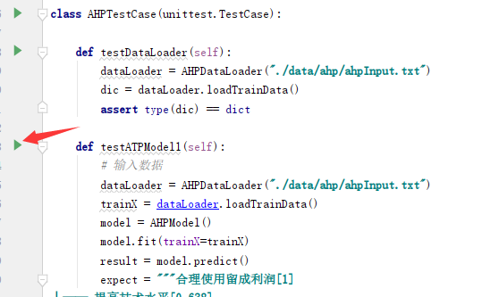

#  模型演示 前端时纯tkinter写的

##  配置模型


##  训练模型


##  测试模型


##  使用模型预测


#  运行

## 安装依赖包 

```
pip install -r requirements.txt
```
## 前端

```
双击目录下 app.bat 可以看到目前版本
```
## 测试模型

> 在modelTest.py中每个单元测试类对应于某个模型的数据加载和运行,
> 在pycharm中可以单独运行某个测试查看结果。



#  贡献

| Contributor |                           |      |
| ----------- | ------------------------- | ---- |
| @Xzzf       | Rebet、GA                 |      |
| @motuer97   | GBM、HLM                  |      |
| @Dokeyy     | RFANFIS、IBRT             |      |
| @9DemonFox  | AHP、SALP、代码框架和前端 |      |
