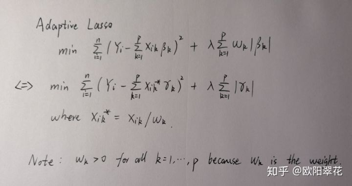

# 1. 梯度提升机 (Gradient Boosting Machine)

论文中将梯度提升机算法作为参照，与其他算法进行对比，且使用了两种损失函数，分别是：

- Quadric 损失函数
    $$
    L(y_i, f_i(x)) = (y_i - f_i(x))^2 / 2
    $$

- Laplace 损失函数
    $$
    L(y_i, f_i(x)) = |y_i- f_i(x)|
    $$

## 1.1 GBM 参数说明

因论文中并没指出所使用的参数设置，故某些参数凭经验设置，且因用 `scikit-learn` 实现，故某些参数保持默认。

```
loss: default="ls"
有均方差"ls", 绝对损失"lad", Huber损失"huber"和分位数损失"quantile"。

n_estimators: int, default=100
也就是弱学习器的最大迭代次数，或者说最大的弱学习器的个数。
一般来说n_estimators太小，容易欠拟合，n_estimators太大，又容易过拟合，一般选择一个适中的数值

learning_rate: float, default=0.1
学习率，即每个弱学习器的权重缩减系数。

max_depth: int, default=3
单个回归估计量的最大深度。最大深度限制了树中的节点数。默认为3.

min_samples_split: int or float, default=2 
分割一个内部节点所需的最小样本数：
如果是int，则考虑min_samples_split作为最小值。
如果是float，那么min_samples_split是一个分数，而ceil(min_samples_split * n_samples)是每个分割的最小样本数。

subsample：float, default=1.0
子采样，如果取值为1，则全部样本都使用，等于没有使用子采样。如果取值小于1，则只有一部分样本会去做拟合。选择小于1的比例可以减少方差，即防止过拟合，但是会增加样本拟合的偏差，因此取值不能太低。推荐在[0.5, 0.8]之间，默认是1.0，即不使用子采样。
...
```

# 2. I-BRT

该论文中提到了其它相关的方法，GBT

## 2.1 I-BRT参数说明

```
模型初始化参数
    n_iter:int
        迭代次数，即基本树的个数
    _gamma : float
        正则项系数
    _lamda : float
        正则项系数
    max_depth: int
        基本树的最大深度（这里代替了原文中的最大叶节点数）

dataloader参数
    fra : int
        扩展数据的倍数，由于数据为小样本，需要按此倍数扩展原始数据
```

> SVR 模型使用Ｒ 软件包E1071 计算; 神经网

# 3. SALP

该论文中提到了其它相关的方法，SVR

## 3.1 SVR参数说明，默认采用

论文原文

> SVR 模型使用Ｒ 软件包E1071 计算; 神经网络模型使用Ｒ 软件包NNET 实现。后两者的参数主要采用了默认值。

```
kernel ： string，optional（default ='rbf'）
指定要在算法中使用的内核类型。它必须是'linear'，'poly'，'rbf'，'sigmoid'，'precomputed'或者callable之一。如果没有给出，将使用'rbf'。如果给出了callable，则它用于预先计算内核矩阵。
degree： int，可选（默认= 3）
多项式核函数的次数（'poly'）。被所有其他内核忽略。
gamma ： float，optional（默认='auto'）
'rbf'，'poly'和'sigmoid'的核系数。
当前默认值为'auto'，它使用1 / n_features，如果gamma='scale'传递，则使用1 /（n_features * X.std（））作为gamma的值。当前默认的gamma''auto'将在版本0.22中更改为'scale'。'auto_deprecated'，'auto'的弃用版本用作默认值，表示没有传递明确的gamma值。
coef0 ： float，optional（默认值= 0.0）
核函数中的独立项。它只在'poly'和'sigmoid'中很重要。
tol ： float，optional（默认值= 1e-3）
容忍停止标准。
C ： float，可选（默认= 1.0）
错误术语的惩罚参数C.
epsilon ： float，optional（默认值= 0.1）
Epsilon在epsilon-SVR模型中。它指定了epsilon-tube，其中训练损失函数中没有惩罚与在实际值的距离epsilon内预测的点。
收缩 ： 布尔值，可选（默认= True）
是否使用收缩启发式。
cache_size ： float，可选
指定内核缓存的大小（以MB为单位）。
详细说明 ： bool，默认值：False
启用详细输出。请注意，此设置利用libsvm中的每进程运行时设置，如果启用，则可能无法在多线程上下文中正常运行。
max_iter ： int，optional（默认值= -1）
求解器内迭代的硬限制，或无限制的-1
```

```
data_train = np.loadtxt(open(datapath1, "rb"), delimiter=",", skiprows=0)
data_test = np.loadtxt(open(datapath2, "rb"), delimiter=",", skiprows=0)
```

## 3.2 SALP

算法在转换权重后再使用Lasso将不再获得参数，待处理
### 与原论文对比
偏最小二乘算法获得的系数完全无效，采用OLS算法得出的系数有效，但是对比带有Grid搜索的相关算法来选取最优参数，似乎以偏最小二乘作为初始化参数并不能正确的选择变量，甚至OLS的都有效果。

### 3.2.1 通过转换X，将标准的Lasso转为为Adaptive Lasso

取对于每个x,取x* = x/w



### 3.2.2  ASGL
asgl是一个处理线性回归相关的python包，可以直接采用其中的相关算法。
https://github.com/alvaromc317/asgl/blob/master/user_guide.ipynb

# 4. RE-BET

该论文中提到了其它相关的方法，MERT

## 4.1 MERT参数说明，默认采用

论文原文

> MERT模型中使用了cart回归树，树中的参数设为了默认值

```
epoch:int
        循环轮数
    n : int
        观测对象种类数量
    N : int
        观测次数
    m : int
        每种观测对象的观测次数
    D : array
        随机效应变量的协方差矩阵
    q : int
        随机效应变量数
    u : array
        随机效应变量
    σ2 : float
        误差的方差
    z : array
        随机效应参数
```

## 4.2 REBET参数说明，默认采用

论文原文

> REBET模型中使用了cart回归树，树中的参数设为了默认值

```
epoch:int
        循环轮数
    n : int
        观测对象种类数量
    N : int
        观测次数
    m : int
        每种观测对象的观测次数
    D:  array
        迪利克雷参数中的协方差矩阵
    q : int
        随机效应变量数
    u : array
        随机效应变量
    σ2 : float
        误差的方差
    z : array
        随机效应参数
    M:  float
        迪利克雷分布参数
```

# 7. AHP 层次分析法

## 7.1 示例

**例1** 某工厂有一笔企业留成利润，需要决定如何分配使用。已经决定有三种用途：奖金、集体福利措施、引进技术设备。考察准则也有三个：是否能调动职工的积极性、是否有利于提高技术水平、考虑改善职工生活条件。建立如下图所示层次模型：


经过工厂决策人员讨论，得到如下判断矩阵：

（1）第2层对第1层。

三个元素C1, C2, C3都受A支配，判断矩阵C{1}{1,1}为


相应的逻辑数组C{1}{2,1}为[true true true]。


（2）第3层对第2层。

1）第3层对第2层第1个元素C1：

受C1支配的只有两个元素P1和P2，判断矩阵C{2}{1,1}为


2）第3层对第2层第2个元素C2：

受C2支配的只有两个元素P2和P3，判断矩阵C{2}{1,2}为


3）第3层对第2层第3个元素C3：

受C3支配的只有两个元素P1和P2，判断矩阵C{2}{1,3}为


示例中**输入数据**如下：

```
        trainX = {'method': 'eigenvalue',
                  'name': '合理使用留成利润',
                  'criteria': ['调动职工积极性', '提高技术水平', '改善职工生活条件'],
                  'preferenceMatrices': {'criteria': [['1', '0.2', '0.33'],  # 准则层
                                                      ['5', '1', '3'],
                                                      ['3', '0.33', '1']],
                                         'subCriteria:调动职工积极性': [['1', '0.33'],
                                                                 ['3', '1']],
                                         'subCriteria:提高技术水平': [['1', '0.2'],
                                                                ['5', '1']],
                                         'subCriteria:改善职工生活条件': [['1', '0.5'],
                                                                  ['2', '1']],
                                         },
                  'subCriteria': {'调动职工积极性': ['奖金', '集体福利'],  # 决策层
                                  '提高技术水平': ['集体福利', '引进设备技术'],
                                  '改善职工生活条件': ['奖金', '集体福利'],
                                  }
                  }
```

输入数据示例2：

```
 trainX = {'criteria': ['子准则层1', '子准则层2', '子准则层3', '子准则层4', '子准则层5'],
                  'method': 'eigenvalue',
                  'name': '画像',
                  'preferenceMatrices': {'criteria': [['1', '1', '2', '1', '2'],  # 准则层
                                                      ['1', '1', '2', '1', '1'],
                                                      ['0.5', '0.5', '1', '1', '1'],
                                                      ['1', '1', '1', '1', '2'],
                                                      ['0.5', '1', '1', '0.5', '1']],
                                         'subCriteria:子准则层1': [['1', '1', '1', '1'],
                                                               ['1', '1', '1', '1'],
                                                               ['1', '1', '1', '1'],
                                                               ['1', '1', '1', '1']],
                                         'subCriteria:子准则层2': [['1', '2'], ['0.5', '1']],
                                         'subCriteria:子准则层3': [['1']],
                                         'subCriteria:子准则层4': [['1', '3'], ['0.33', '1']],
                                         'subCriteria:子准则层5': [['1', '2', '3'],
                                                               ['0.5', '1', '2'],
                                                               ['0.33', '0.5', '1']]},
                  'subCriteria': {'子准则层1': ['兽残不合格量', '毒素不合格量', '污染物不合格量', '重金属不合格量'],  
                                  '子准则层2': ['U1占比', '综合合格率'],
                                  '子准则层3': ['周期内预警触发次数*'],
                                  '子准则层4': ['牧场整改率', '牧场食品安全评审结果'],
                                  '子准则层5': ['主要理化指标Cpk*', '体细胞Cpk*', '微生物Cpk*']}}
```

# 8. GA 遗传算法
用于求解函数最值问题
## 8.1 GA参数说明，默认采用
```
c:int,必选
指定求函数的最大值或最小值，‘1’为求最大值，‘0’为求最小值
F:function,必选
指定所要求最值的函数表达式
n:int,必选
指定函数所含变量个数
ranges:array,必选
指定各个变量的取值范围
precisions:int,可选（默认值 = 24）
指定精度
N_GENERATIONS:int,可选（默认值 = 50）
指定迭代轮数
POP_SIZE:int,可选（默认值 = 200）
指定种群大小
MUTATION_RATE:float,可选（默认值 = 0.005）
指定变异概率
CROSSOVER_RATE:float,可选（默认值 = 0.8）
指定交叉概率
```
